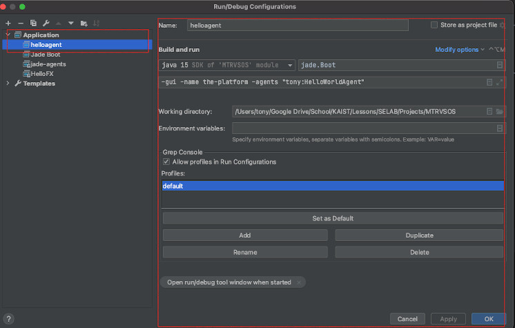
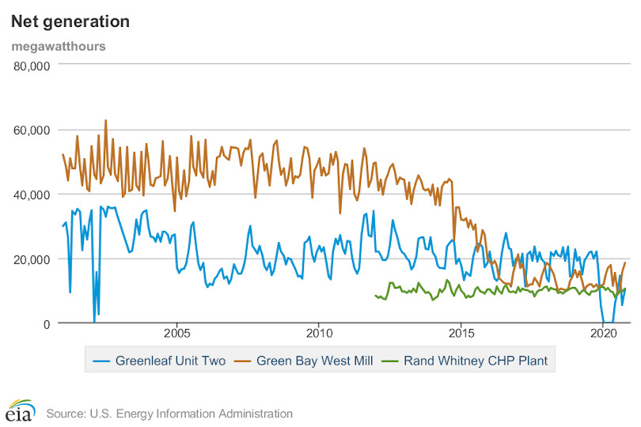
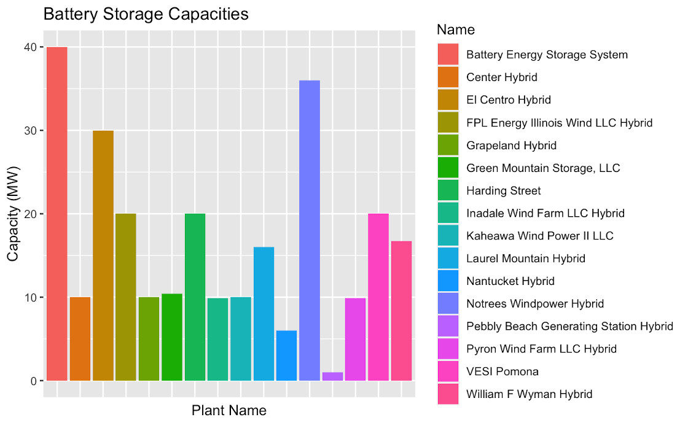
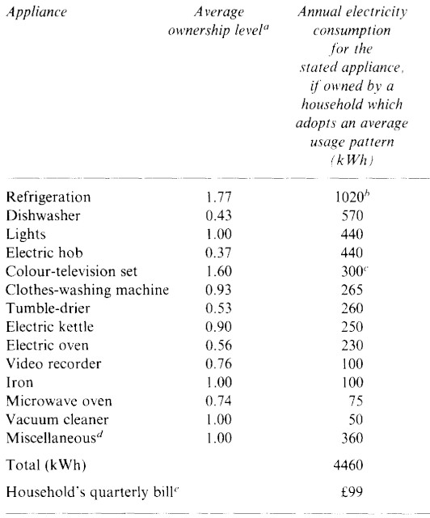

# Smart Grid Simulator
## About
A smart grid simulator built using Jade and JavaFX.

In this project, I simulate  a smart grid System of Systems (SoS) using agent based modelling.

Each constituent system in the smart grid SoS is represented by an agent in the Jade framework.

## Requirements
- Project built using Java AdoptOpenJDK 15.0.2
- Intellij (Java) Project Language Level: 11
- See pom.xml for dependencies.

## To Run
- Ensure that you have >= Java 11 installed.
- Run the shaded.jar file located in the folder named target.

        java -jar MTRVSOS-1.0-SNAPSHOT-shaded.jar

## Project Setup (Maven)
### Background
- Although Jade is hosted on Maven by [Tilab](https://jade.tilab.com/developers/maven/), during pom installation, the jade artifact cannot be successfully obtained.
- For maven-shade-plugin to succesfully package a shaded jar, all dependencies need to be available on maven.

### Workaround 1: Development only, not packaging as Shaded Jar
1. Rename pom_no_nexus.xml to pom.xml and use Maven to install all dependencies.
2. Make sure that resources folder is marked as project resource root in Intellij.
3. Run SmartGridRunner main to start the application. (intellij run config also included in project.)

### Workaround 2: Development and packaging (preferred method)
#### Development
- Run a local self hosted maven repository(nexus) using Docker.
- [Instructions to run the docker image here, webconsole and admin login](https://hub.docker.com/r/sonatype/nexus3)
- [Use the web console for nexus, login and upload jade as a maven artifact.](https://help.sonatype.com/repomanager3/user-interface/uploading-components)
- Follow the naming convention during uploading as shown below:
  
      <groupId>com.tilab.jade</groupId>
      <artifactId>jade</artifactId>
      <version>4.5.0</version>
- Use the settings.xml included in this project and modify (profiles, mirrors) if necessary.
- Use pom.xml and install the dependencies using maven.
  1. Maven should detect your docker instance of the nexus repo and download the uploaded jade artifact successfully.
- Run SmartGridRunner main to start the application. (intellij run config also included in project.)
#### Packaging the application as a fat jar.
- Packaging is done using the configuration for maven-shade-plugin in pom.xml.
- Use maven to run the maven package lifecyle and a snapshot.jar should be generated in target.
- Run the snapshot jar using java -jar. (Make sure that Java has the same version as this application)

## How to setup and run (without maven)
1. In your IDE (Intellij), add all jar files in "JADE-all-4.5.0" and "javafx-sdk-15.0.1"
2. Add everything in "lib" to project library.
3. Run config for intellij (old):
    
3. Run SmartGridRunner main (current)

## Changeable Variables Description
Found in Settings.java

    //Rate Flags
    private int rateSecsPowerGen = 1000; //in ms, power gen rate / ms
    private int rateSecsSmartHome = 1000; //in ms, power consumption rate / ms
    private int houseUnit = 100; //each smart home agent's unit size, ie, 100 means 1 smart home agent in UI = 100 smart home agents.
    private int secondsToRun = 600; //in seconds, total time for simulator to run before quitting.

    //UI Size
    private int multiplier = 2; //image size multiplier
    private int imageHeightXY = 30; //image size for powergen, power dis
    private int homeImageXY = 20; //image size for  smarthomes
    private int evImageXY = 15; //image size for evs
    private double canvasX = 1024; //windows size x
    private double canvasY = 768; //windows size y

    private boolean pauseSimulation = false; //DO NOT TOUCH, used for pause/play
    private int simCheckRate = 200; //in ms, rate at which agent checks the pause state of the world. lesser means faster 

    //Agent Flags
    private int numPowerAgents = 2; //number of power agents
    private int numPowerDisAgents = 5; //number of power distribution/storage agents
    private int numSmartHomeAgents = 5; //number of smart home agents
    private int numEVAgents = 2; //number of ev agents

    private double InitCapacityFactor = 0.70; //capacity factor for power agents

    //SoSAgent Management Flags
    private double preferredUtilisationRate = 85; //target utilisation level
    private double preferredIncrement = 0.02; //increments to hit target utilisation level
    private double powerUtilisationRate = 90; //total power levels % to wait until utilisation algo kicks in

    //other
    private String PORT_NAME = "7778"; //port used
    private String HOSTNAME = "localhost"; //hostname

## Simulated Entities
### Power Generator Agent
- Registers capabilities to yellow pages (DFS) for service discovery.
- Generates power and adds to power grid.
- Transfers power to nearest/next nearest Power Storage and Distribution agents when own capacity is full.
- Able to also transfer power directly to Smart Home Agents.
- Values used for power generation are stored in resources > data > netgen_10k.csv (lowest generator profile).
- At start, the values are uniformly randomly sampled from the csv file.
- Values are sourced from US Energy Information Administration.
    

### Power Storage and Distribution Agent
- Registers capabilities to yellow pages (DFS) for service discovery.
- Accepts power from Power Generation Agents ifff own capacity is not full. Rejects if full.
- Able to transfer power to Smart Home Agents.
- Functions as EV Charger.
- Capacities of this agent and Power Generator Agents are sourced from Form EIA-830, 3_4_Energy_Storage_Y2019, US Energy Information Administration.
- Values are stored in resources > data > storage_capacity.csv
- At start, the values are uniformly randomly sampled from the csv file.
 

### SmartHome Agent
- Registers capabilities to yellow pages (DFS) for service discovery.
- Each Smart Home Agent has a set of Appliances.
- Appliances are randomly sampled from a probability distribution as shown in table.
 
- Sourced from :Mansouri, I., Newborough, M., & Probert, D. (1996). Energy consumption in uk households: Impact of domestic electrical appliances. Applied Energy, 54(3 SPEC. ISS.), 211–285. https://doi.org/10.1016/0306-2619(96)00001-3
- Consumption levels were based on the annual usage values in the table and divided into a per hour value in kWh.

### EVAgent
- EV power capacities and power consumption rates were sourced from:
  Dixon, J., & Bell, K. (2020). Electric vehicles: Battery capacity, charger power, access to charging and the impacts on distribution networks. ETransportation, 4, 100059. https://doi.org/10.1016/j.etran.2020.100059
- The consumption rate profiles ere based on the values for movement within a city as shown in the study.
- Each unit of pixel traversed by the EV represents 1km of real world distance.
- EV Charging is triggered when battery is < 30% and searches for nearest or next nearest charger. (Power Storage and Distribution Agent)
- No collision avoidance implemented yet.
- The EV Agent's travelling path is randomly generated each time.
- EV Agents will wait for charging station to have power (up to a set limit) before finding a new charger.

### UI Capabilities
- Pause and play.
- Kill agents on right click context menu > Kill.
- Agents will behave smartly (to some extent) when agents are killed.

### Sos Agent
- Wakes power agents for now
- Calculate consumption vs generation and manage smart grid's efficiency rate as a whole
- Done by contacting Power Gen Agents to adjust capacity factor for each agent.

## Background
### [System of Systems](https://www.sebokwiki.org/wiki/Systems_of_Systems_(SoS))

### [Agent Based Model](https://en.wikipedia.org/wiki/Agent-based_model)

### [Jade](https://jade.tilab.com/)

### [JavaFX](https://openjfx.io/)
